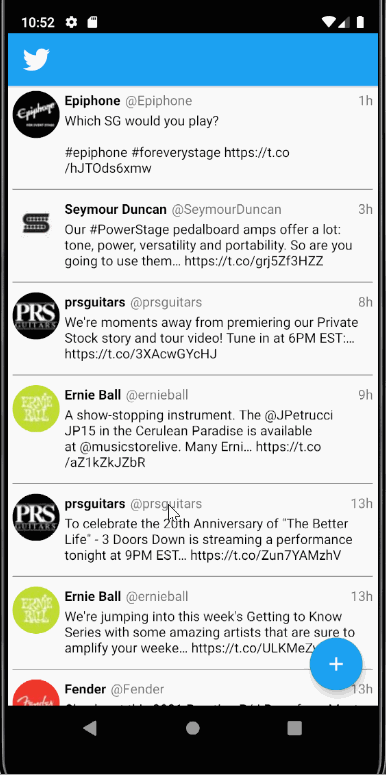

# SimpleTweet

**SimpleTweet** is an Android app that allows the user to view their real Twitter timeline and post a new tweet. The app utilizes the [Twitter REST API](https://dev.twitter.com/rest/public). Made for the CodePath Android University course (Project 2).

## Features

The following features have been implemented:

- User can **compose and post a new tweet**
  - User can click a “Compose” icon (as a floating action button)
  - User can then enter a new tweet and post this to twitter
  - User is taken back to home timeline with **new tweet visible** in timeline
  - Newly created tweet is manually inserted into the timeline and does not rely on a full refresh
  - User can **see a counter with total number of characters left for tweet** on compose tweet page
- User can **view tweets from their home timeline**
  - User is displayed the username, name, and body for each tweet
  - User is displayed the [relative timestamp](https://gist.github.com/nesquena/f786232f5ef72f6e10a7) for each tweet "8m", "7h"
- User can refresh the tweets timeline by pulling down to refresh
- User can view more tweets as they scroll with infinite pagination

## Video Walkthrough

Here's a walkthrough of some implemented features:

GIF created with [LiceCap](http://www.cockos.com/licecap/).

## Open-source libraries used

- [Android Async HTTP](https://github.com/codepath/CPAsyncHttpClient) - Simple asynchronous HTTP requests with JSON parsing
- [Glide](https://github.com/bumptech/glide) - Image loading and caching library for Android
- [Parceler library](https://github.com/johncarl81/parceler) - Android Parcelable boilerplate code generation library

## License

    Copyright 2021 Kyle Townsend

    Licensed under the Apache License, Version 2.0 (the "License");
    you may not use this file except in compliance with the License.
    You may obtain a copy of the License at

        http://www.apache.org/licenses/LICENSE-2.0

    Unless required by applicable law or agreed to in writing, software
    distributed under the License is distributed on an "AS IS" BASIS,
    WITHOUT WARRANTIES OR CONDITIONS OF ANY KIND, either express or implied.
    See the License for the specific language governing permissions and
    limitations under the License.
